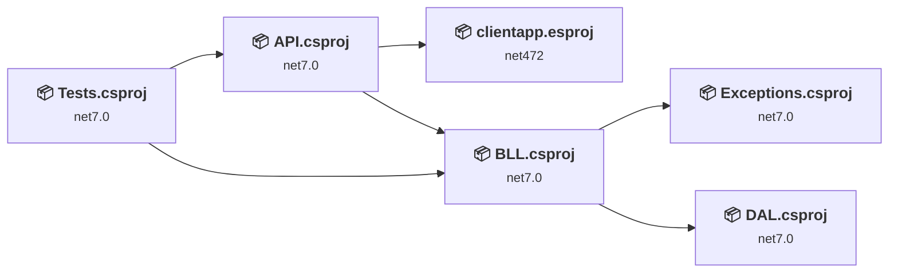
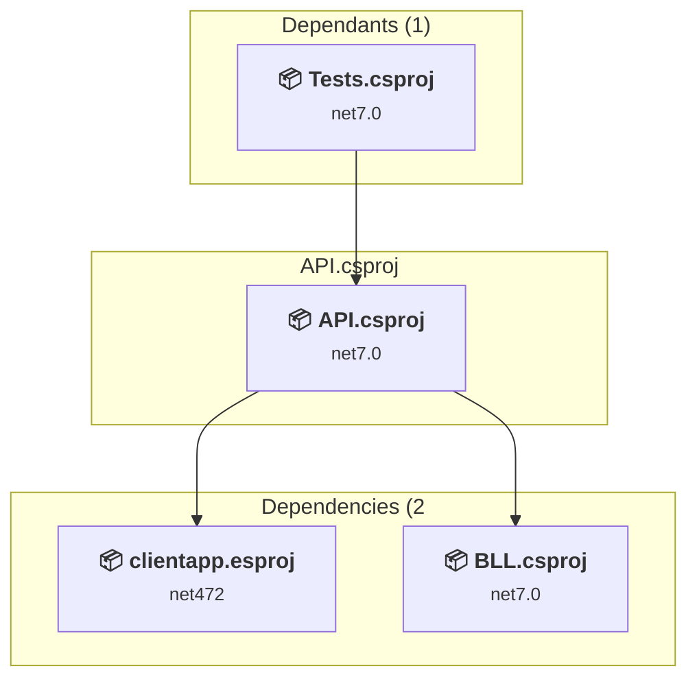
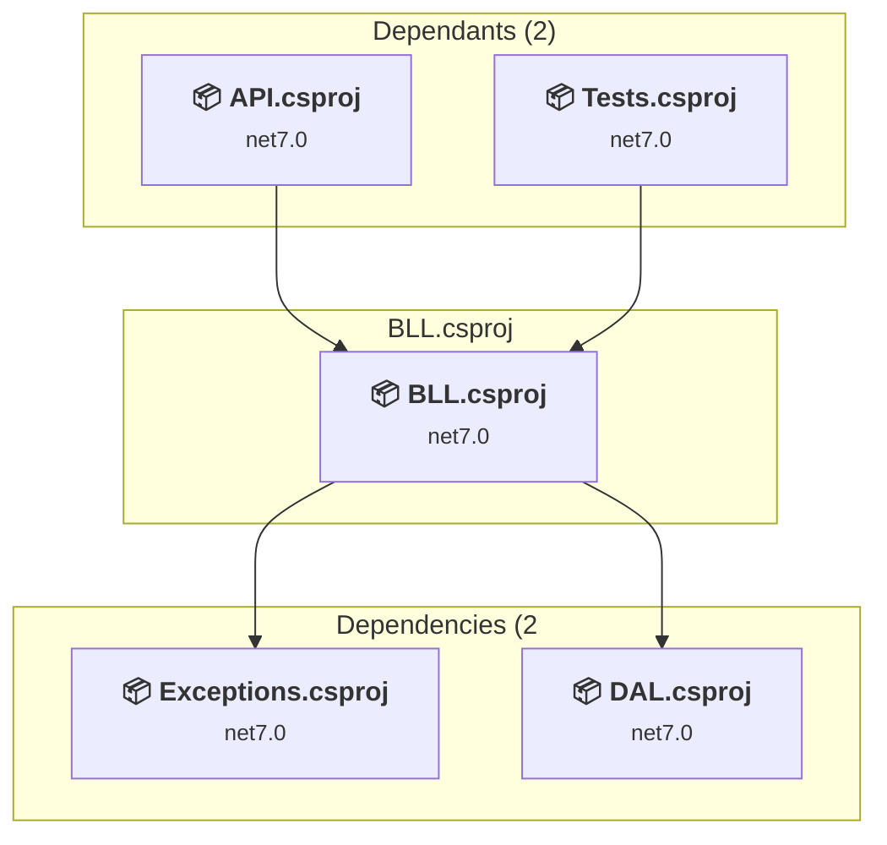
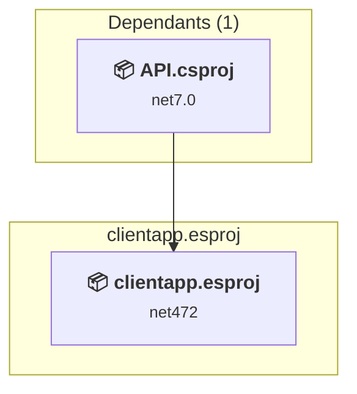
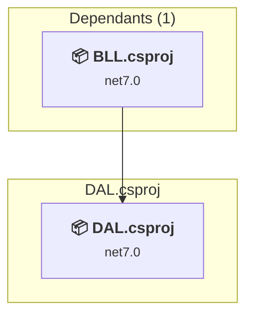
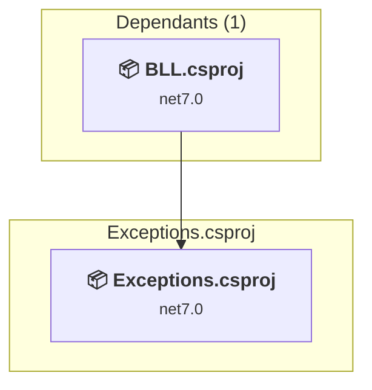
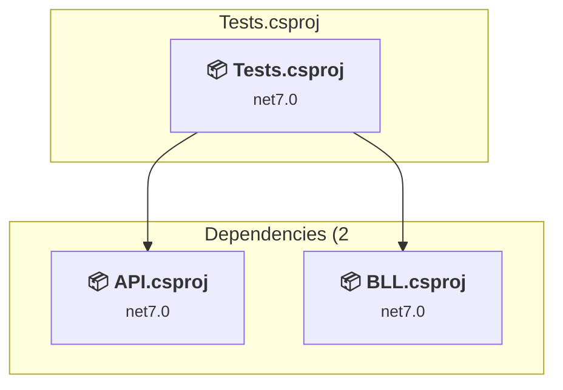

# Projects and dependencies analysis

This document provides a comprehensive overview of the projects and their dependencies in the context of upgrading to .NETCoreApp,Version=v10.0.

## Table of Contents

- [Executive Summary](#executive-Summary)
  - [Highlevel Metrics](#highlevel-metrics)
  - [Projects Compatibility](#projects-compatibility)
  - [Package Compatibility](#package-compatibility)
  - [API Compatibility](#api-compatibility)
- [Aggregate NuGet packages details](#aggregate-nuget-packages-details)
- [Top API Migration Challenges](#top-api-migration-challenges)
  - [Technologies and Features](#technologies-and-features)
  - [Most Frequent API Issues](#most-frequent-api-issues)
- [Projects Relationship Graph](#projects-relationship-graph)
- [Project Details](#project-details)

  - [API\API.csproj](#apiapicsproj)
  - [BLL\BLL.csproj](#bllbllcsproj)
  - [ClientApp\clientapp.esproj](#clientappclientappesproj)
  - [DAL\DAL.csproj](#daldalcsproj)
  - [Exceptions\Exceptions.csproj](#exceptionsexceptionscsproj)
  - [Tests\Tests.csproj](#teststestscsproj)

## Executive Summary

### Highlevel Metrics

| Metric | Count | Status |
| :--- | :---: | :--- |
| Total Projects | 6 | All require upgrade |
| Total NuGet Packages | 22 | 13 need upgrade |
| Total Code Files | 111 |  |
| Total Code Files with Incidents | 7 |  |
| Total Lines of Code | 4896 |  |
| Total Number of Issues | 35 |  |
| Estimated LOC to modify | 10+ | at least 0.2% of codebase |

### Projects Compatibility

| Project | Target Framework | Difficulty | Package Issues | API Issues | Est. LOC Impact | Description |
| :--- | :---: | :---: | :---: | :---: | :---: | :--- |
| [API\API.csproj](#apiapicsproj) | net7.0 | 🟢 Low | 9 | 10 | 10+ | AspNetCore, Sdk Style = True |
| [BLL\BLL.csproj](#bllbllcsproj) | net7.0 | 🟢 Low | 5 | 0 |  | ClassLibrary, Sdk Style = True |
| [ClientApp\clientapp.esproj](#clientappclientappesproj) | net472 | 🟢 Low | 0 | 0 |  | DotNetCoreApp, Sdk Style = True |
| [DAL\DAL.csproj](#daldalcsproj) | net7.0 | 🟢 Low | 3 | 0 |  | ClassLibrary, Sdk Style = True |
| [Exceptions\Exceptions.csproj](#exceptionsexceptionscsproj) | net7.0 | 🟢 Low | 0 | 0 |  | ClassLibrary, Sdk Style = True |
| [Tests\Tests.csproj](#teststestscsproj) | net7.0 | 🟢 Low | 2 | 0 |  | DotNetCoreApp, Sdk Style = True |

### Package Compatibility

| Status | Count | Percentage |
| :--- | :---: | :---: |
| ✅ Compatible | 9 | 40.9% |
| ⚠️ Incompatible | 1 | 4.5% |
| 🔄 Upgrade Recommended | 12 | 54.5% |
| ***Total NuGet Packages*** | ***22*** | ***100%*** |

### API Compatibility

| Category | Count | Impact |
| :--- | :---: | :--- |
| 🔴 Binary Incompatible | 0 | High - Require code changes |
| 🟡 Source Incompatible | 9 | Medium - Needs re-compilation and potential conflicting API error fixing |
| 🔵 Behavioral change | 1 | Low - Behavioral changes that may require testing at runtime |
| ✅ Compatible | 6478 |  |
| ***Total APIs Analyzed*** | ***6488*** |  |

## Aggregate NuGet packages details

| Package | Current Version | Suggested Version | Projects | Description |
| :--- | :---: | :---: | :--- | :--- |
| AutoMapper | 12.0.1 | 16.1.1 | [API.csproj](#apiapicsproj) [BLL.csproj](#bllbllcsproj) | NuGet package contains security vulnerability |
| Braintree | 5.16.0 |  | [BLL.csproj](#bllbllcsproj) | ✅Compatible |
| coverlet.collector | 3.1.2 |  | [Tests.csproj](#teststestscsproj) | ✅Compatible |
| MailKit | 3.6.0 |  | [API.csproj](#apiapicsproj) [BLL.csproj](#bllbllcsproj) | ✅Compatible |
| Microsoft.AspNetCore.Authentication.Google | 7.0.4 | 10.0.5 | [API.csproj](#apiapicsproj) | NuGet package upgrade is recommended |
| Microsoft.AspNetCore.Authentication.JwtBearer | 7.0.4 | 10.0.5 | [API.csproj](#apiapicsproj) | NuGet package upgrade is recommended |
| Microsoft.AspNetCore.Http.Features | 5.0.17 |  | [BLL.csproj](#bllbllcsproj) | ⚠️NuGet package is deprecated |
| Microsoft.AspNetCore.Identity.EntityFrameworkCore | 7.0.3 | 10.0.5 | [DAL.csproj](#daldalcsproj) | NuGet package upgrade is recommended |
| Microsoft.AspNetCore.Identity.EntityFrameworkCore | 7.0.4 | 10.0.5 | [API.csproj](#apiapicsproj) [BLL.csproj](#bllbllcsproj) | NuGet package upgrade is recommended |
| Microsoft.AspNetCore.SpaProxy | 7.0.5 | 10.0.5 | [API.csproj](#apiapicsproj) | NuGet package upgrade is recommended |
| Microsoft.EntityFrameworkCore | 7.0.3 | 10.0.5 | [DAL.csproj](#daldalcsproj) | NuGet package upgrade is recommended |
| Microsoft.EntityFrameworkCore | 7.0.4 | 10.0.5 | [API.csproj](#apiapicsproj) [BLL.csproj](#bllbllcsproj) [Tests.csproj](#teststestscsproj) | NuGet package upgrade is recommended |
| Microsoft.EntityFrameworkCore.Proxies | 7.0.4 | 10.0.5 | [API.csproj](#apiapicsproj) | NuGet package upgrade is recommended |
| Microsoft.EntityFrameworkCore.SqlServer | 7.0.4 | 10.0.5 | [API.csproj](#apiapicsproj) [Tests.csproj](#teststestscsproj) | NuGet package upgrade is recommended |
| Microsoft.Extensions.Configuration | 7.0.0 | 10.0.5 | [DAL.csproj](#daldalcsproj) | NuGet package upgrade is recommended |
| Microsoft.NET.Test.Sdk | 17.3.2 |  | [Tests.csproj](#teststestscsproj) | ✅Compatible |
| MimeKit | 3.6.0 | 4.15.1 | [API.csproj](#apiapicsproj) [BLL.csproj](#bllbllcsproj) | NuGet package contains security vulnerability |
| Moq | 4.18.4 |  | [DAL.csproj](#daldalcsproj) [Tests.csproj](#teststestscsproj) | ✅Compatible |
| Ninject | 3.3.6 |  | [API.csproj](#apiapicsproj) [BLL.csproj](#bllbllcsproj) | ✅Compatible |
| NUnit | 3.13.3 |  | [Tests.csproj](#teststestscsproj) | ✅Compatible |
| NUnit.Analyzers | 3.5.0 |  | [Tests.csproj](#teststestscsproj) | ✅Compatible |
| NUnit3TestAdapter | 4.3.0 |  | [Tests.csproj](#teststestscsproj) | ✅Compatible |

## Top API Migration Challenges

### Technologies and Features

| Technology | Issues | Percentage | Migration Path |
| :--- | :---: | :---: | :--- |

### Most Frequent API Issues

| API | Count | Percentage | Category |
| :--- | :---: | :---: | :--- |
| P:Microsoft.AspNetCore.Authentication.JwtBearer.JwtBearerOptions.TokenValidationParameters | 1 | 10.0% | Source Incompatible |
| T:Microsoft.AspNetCore.Authentication.JwtBearer.JwtBearerDefaults | 1 | 10.0% | Source Incompatible |
| F:Microsoft.AspNetCore.Authentication.JwtBearer.JwtBearerDefaults.AuthenticationScheme | 1 | 10.0% | Source Incompatible |
| T:Microsoft.Extensions.DependencyInjection.JwtBearerExtensions | 1 | 10.0% | Source Incompatible |
| M:Microsoft.Extensions.DependencyInjection.JwtBearerExtensions.AddJwtBearer(Microsoft.AspNetCore.Authentication.AuthenticationBuilder,System.Action{Microsoft.AspNetCore.Authentication.JwtBearer.JwtBearerOptions}) | 1 | 10.0% | Source Incompatible |
| M:System.TimeSpan.FromDays(System.Double) | 1 | 10.0% | Source Incompatible |
| M:System.TimeSpan.FromMinutes(System.Double) | 1 | 10.0% | Source Incompatible |
| T:Microsoft.Extensions.DependencyInjection.IdentityEntityFrameworkBuilderExtensions | 1 | 10.0% | Source Incompatible |
| M:Microsoft.Extensions.DependencyInjection.IdentityEntityFrameworkBuilderExtensions.AddEntityFrameworkStores''1(Microsoft.AspNetCore.Identity.IdentityBuilder) | 1 | 10.0% | Source Incompatible |
| M:Microsoft.Extensions.Logging.ConsoleLoggerExtensions.AddConsole(Microsoft.Extensions.Logging.ILoggingBuilder) | 1 | 10.0% | Behavioral Change |

## Projects Relationship Graph

Legend:
📦 SDK-style project
⚙️ Classic project

## Project Details

### API\API.csproj

#### Project Info

- **Current Target Framework:** net7.0
- **Proposed Target Framework:** net10.0
- **SDK-style**: True
- **Project Kind:** AspNetCore
- **Dependencies**: 2
- **Dependants**: 1
- **Number of Files**: 47
- **Number of Files with Incidents**: 2
- **Lines of Code**: 2167
- **Estimated LOC to modify**: 10+ (at least 0.5% of the project)

#### Dependency Graph

Legend:
📦 SDK-style project
⚙️ Classic project

### API Compatibility

| Category | Count | Impact |
| :--- | :---: | :--- |
| 🔴 Binary Incompatible | 0 | High - Require code changes |
| 🟡 Source Incompatible | 9 | Medium - Needs re-compilation and potential conflicting API error fixing |
| 🔵 Behavioral change | 1 | Low - Behavioral changes that may require testing at runtime |
| ✅ Compatible | 3165 |  |
| ***Total APIs Analyzed*** | ***3175*** |  |

### BLL\BLL.csproj

#### Project Info

- **Current Target Framework:** net7.0
- **Proposed Target Framework:** net10.0
- **SDK-style**: True
- **Project Kind:** ClassLibrary
- **Dependencies**: 2
- **Dependants**: 2
- **Number of Files**: 42
- **Number of Files with Incidents**: 1
- **Lines of Code**: 1599
- **Estimated LOC to modify**: 0+ (at least 0.0% of the project)

#### Dependency Graph

Legend:
📦 SDK-style project
⚙️ Classic project

### API Compatibility

| Category | Count | Impact |
| :--- | :---: | :--- |
| 🔴 Binary Incompatible | 0 | High - Require code changes |
| 🟡 Source Incompatible | 0 | Medium - Needs re-compilation and potential conflicting API error fixing |
| 🔵 Behavioral change | 0 | Low - Behavioral changes that may require testing at runtime |
| ✅ Compatible | 1923 |  |
| ***Total APIs Analyzed*** | ***1923*** |  |

### ClientApp\clientapp.esproj

#### Project Info

- **Current Target Framework:** net472
- **Proposed Target Framework:** net10.0
- **SDK-style**: True
- **Project Kind:** DotNetCoreApp
- **Dependencies**: 0
- **Dependants**: 1
- **Number of Files**: 0
- **Number of Files with Incidents**: 1
- **Lines of Code**: 0
- **Estimated LOC to modify**: 0+ (at least 0.0% of the project)

#### Dependency Graph

Legend:
📦 SDK-style project
⚙️ Classic project

### API Compatibility

| Category | Count | Impact |
| :--- | :---: | :--- |
| 🔴 Binary Incompatible | 0 | High - Require code changes |
| 🟡 Source Incompatible | 0 | Medium - Needs re-compilation and potential conflicting API error fixing |
| 🔵 Behavioral change | 0 | Low - Behavioral changes that may require testing at runtime |
| ✅ Compatible | 0 |  |
| ***Total APIs Analyzed*** | ***0*** |  |

### DAL\DAL.csproj

#### Project Info

- **Current Target Framework:** net7.0
- **Proposed Target Framework:** net10.0
- **SDK-style**: True
- **Project Kind:** ClassLibrary
- **Dependencies**: 0
- **Dependants**: 1
- **Number of Files**: 22
- **Number of Files with Incidents**: 1
- **Lines of Code**: 640
- **Estimated LOC to modify**: 0+ (at least 0.0% of the project)

#### Dependency Graph

Legend:
📦 SDK-style project
⚙️ Classic project

### API Compatibility

| Category | Count | Impact |
| :--- | :---: | :--- |
| 🔴 Binary Incompatible | 0 | High - Require code changes |
| 🟡 Source Incompatible | 0 | Medium - Needs re-compilation and potential conflicting API error fixing |
| 🔵 Behavioral change | 0 | Low - Behavioral changes that may require testing at runtime |
| ✅ Compatible | 625 |  |
| ***Total APIs Analyzed*** | ***625*** |  |

### Exceptions\Exceptions.csproj

#### Project Info

- **Current Target Framework:** net7.0
- **Proposed Target Framework:** net10.0
- **SDK-style**: True
- **Project Kind:** ClassLibrary
- **Dependencies**: 0
- **Dependants**: 1
- **Number of Files**: 5
- **Number of Files with Incidents**: 1
- **Lines of Code**: 44
- **Estimated LOC to modify**: 0+ (at least 0.0% of the project)

#### Dependency Graph

Legend:
📦 SDK-style project
⚙️ Classic project

### API Compatibility

| Category | Count | Impact |
| :--- | :---: | :--- |
| 🔴 Binary Incompatible | 0 | High - Require code changes |
| 🟡 Source Incompatible | 0 | Medium - Needs re-compilation and potential conflicting API error fixing |
| 🔵 Behavioral change | 0 | Low - Behavioral changes that may require testing at runtime |
| ✅ Compatible | 51 |  |
| ***Total APIs Analyzed*** | ***51*** |  |

### Tests\Tests.csproj

#### Project Info

- **Current Target Framework:** net7.0
- **Proposed Target Framework:** net10.0
- **SDK-style**: True
- **Project Kind:** DotNetCoreApp
- **Dependencies**: 2
- **Dependants**: 0
- **Number of Files**: 4
- **Number of Files with Incidents**: 1
- **Lines of Code**: 446
- **Estimated LOC to modify**: 0+ (at least 0.0% of the project)

#### Dependency Graph

Legend:
📦 SDK-style project
⚙️ Classic project

### API Compatibility

| Category | Count | Impact |
| :--- | :---: | :--- |
| 🔴 Binary Incompatible | 0 | High - Require code changes |
| 🟡 Source Incompatible | 0 | Medium - Needs re-compilation and potential conflicting API error fixing |
| 🔵 Behavioral change | 0 | Low - Behavioral changes that may require testing at runtime |
| ✅ Compatible | 714 |  |
| ***Total APIs Analyzed*** | ***714*** |  |

